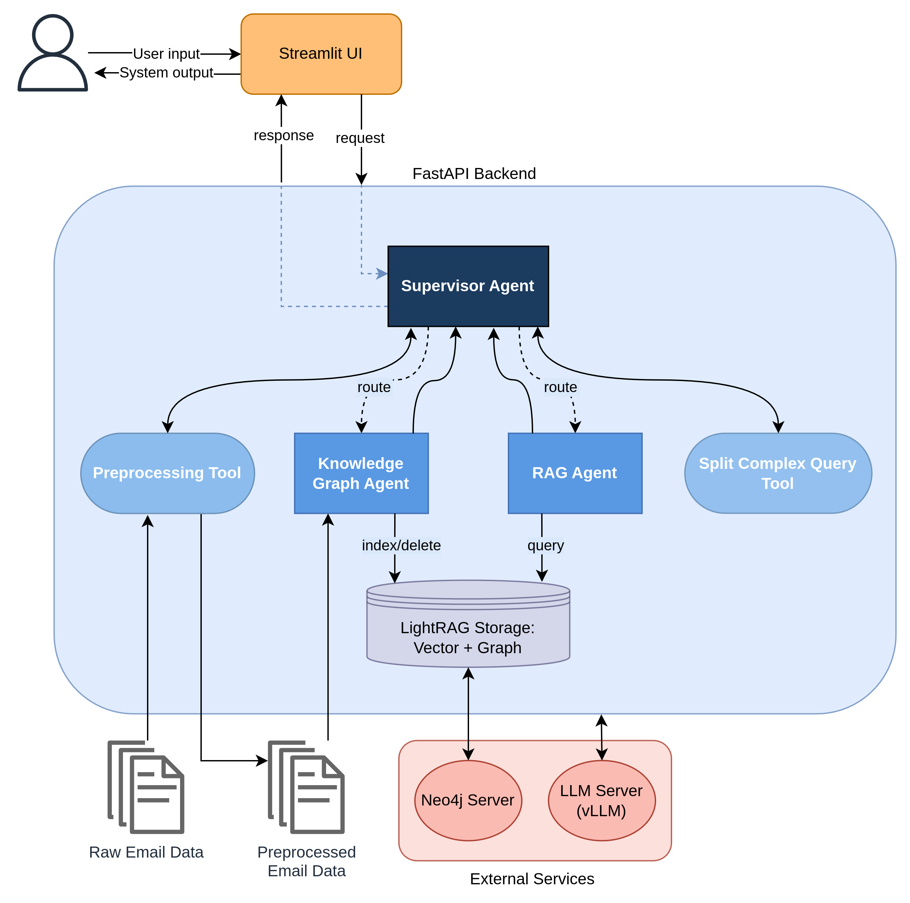

# RAG Multi-Agent System: Enterprise Email Information Extraction

This repository contains the implementation of my thesis, **"Automating Information Extraction from Emails using Large Language Models"**.
It presents a high-performance Multi-Agent System (MAS) that converts unstructured enterprise email workflows into structured, queryable knowledge. The system combines **retrieval-augmented generation (RAG)** pipelines with a **supervisor-agent architecture**, coordinating multiple specialized agents for efficient and scalable processing. It is deployed via **FastAPI** and features a **Streamlit-based chatbot interface**, allowing users to interactively generate and query knowledge graphs extracted from their email workflows.

## System Architecture
<p align="center">
  
</p>

## Prerequisites
- Python 3.12 installed
- `ollama` installed ([Installation Guide](https://ollama.ai/))
- `.msg` email files available for processing
- [LangSmith](https://docs.langchain.com/langsmith/create-account-api-key#api-keys) api key 
- [Huggingface](https://huggingface.co/settings/tokens) api key
- Neo4j server running (Docker-based setup)
- 4 gpus with VRAM >= 16GB and compute capability >= 7

## Getting Started:

### Create a Virtual Environment:
Run the following command in your project's root directory:

#### For Linux/macOS: 
```sh
python3 -m venv myvenv  
source myvenv/bin/activate 
```
or
```sh
conda create -n myvenv python=3.12 -y
conda activate myvenv
```
#### For Windows: 
```sh
python -m venv myvenv   
myvenv\Scripts\activate 
```
or
```sh
conda create -n myvenv python=3.12 -y
conda activate myvenv
```

### Clone the Repository:
```sh
git clone https://github.com/ChrysMan/llm-automated-email-parser.git
```

### Install Dependencies:
```sh
pip install -r requirements.txt
```

### Download the LLM Model
Before running the program, download the required model (or any model you wish to use):
```sh
ollama pull llama3.1
```

### Execute Program:

#### Serve the required models using vLLM
```sh
./serving/serve_models.sh
```

#### First approach: RAG on Vector Database
```sh
cd src
# Preprocess the raw email data
python -m preprocessing_implementations.vllm_serve /path/to/your/data/directory   
# Create a vector database from a deduplicated email list
python -m vectorDB_impl.create_vectorDB_model.py /path/to/your/data/file
# Run Retrieval-Augmented Generation (RAG) on the vector database
python -m vectorDB_impl.rag_embedDB.py
```

#### Second approach: GraphRAG on Knowledge Graph
```sh
cd src
# Preprocess the raw email data
python -m preprocessing_implementations.vllm_serve /path/to/your/data/directory   
# Create Neo4j knowledge graph from emails
python -m graphrag_impl.vectorDB_impl.create_kg /path/to/your/data/directory
# Run the bot with an agent implementing RAG on the knowledge graph
python -m streamlit run graphrag_impl..bot  
```

##### Note: 
*/path/to/your/data/directory should be replaced with the actual path where your `.msg` files are stored.*

#### Third approach: GraphRAG on Knowledge Graph using [LightRAG](https://github.com/HKUDS/LightRAG)
This is the final implementation chosen for the project, integrating the multi-agent system with the Streamlit interface and FastAPI backend.
```sh
cd src
# In a second terminal serve the multi-agent system's api
uvicorn lightrag_imp.api.main:app --reload --port 8080
# In a third terminal run the streamlit ui
python -m streamlit run lightrag_imp/ui/streamlit_ui.py
```

