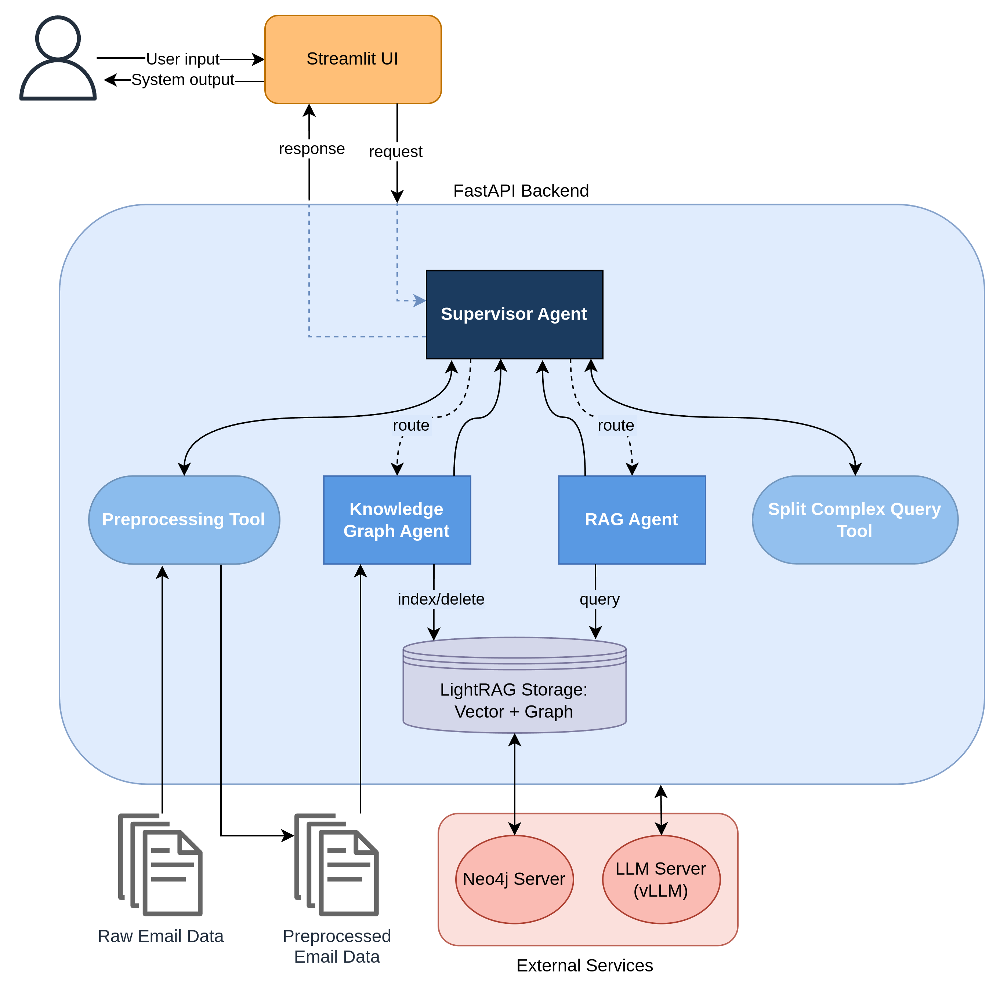

# RAG Multi-Agent System: Enterprise Email Information Extraction

This repository contains the implementation of my thesis, **"Automating Information Extraction from Emails using Large Language Models"**.
It presents a high-performance Multi-Agent System (MAS) that converts unstructured enterprise email workflows into structured, queryable knowledge. The system combines **retrieval-augmented generation (RAG)** pipelines with a **supervisor-agent architecture**, coordinating multiple specialized agents for efficient and scalable processing. It is deployed via **FastAPI** and features a **Streamlit-based chatbot interface**, allowing users to interactively generate and query knowledge graphs extracted from their email workflows.

Three inference techniques were evaluated:
- Sequential offline inference
- Offline batched inference using vLLM engine
- Concurrent inference via vLLM HTTP server

Experimented with two prompting methods:
- 4 Prompts: Four distinct prompts for translation, formatting, headers, and body.
- 2 Prompts: Two distinct prompts that combine translation with formatting, and headers with body.
  
Three different RAG architectures were implemented: 
- Naive RAG on Vector Database
- GraphRAG
- Advanced GraphRAg using [LightRAG](https://github.com/HKUDS/LightRAG) framework

## Final System Architecture 
<p align="center">
  
</p>

## Prerequisites
- Python 3.12 installed
- `ollama` installed ([Installation Guide](https://ollama.ai/))
- `.msg` email files available for processing
- [LangSmith](https://docs.langchain.com/langsmith/create-account-api-key#api-keys) api key 
- [Huggingface](https://huggingface.co/settings/tokens) api key
- [Gemini](https://ai.google.dev/gemini-api/docs/api-key) api key (for evaluation)
- Neo4j server running (Docker-based setup)
- 4 gpus with VRAM >= 16GB and compute capability >= 7

## Getting Started:

### Create a Virtual Environment:
Run the following command in your project's root directory:

```sh
conda myenv create -f environment.yml
conda activate myvenv
```

### Clone the Repository:
```sh
git clone https://github.com/ChrysMan/llm-automated-email-parser.git
```

### Download the LLM Model
Before running the program, download the required model (or any model you wish to use):
```sh
ollama pull embeddinggemma
```

### Execute Program:

#### Serve the required models using vLLM
```sh
./serving/serve_models.sh
```

#### First approach: RAG on Vector Database
```sh
cd src
# Preprocess the raw email data
python -m lightrag_impl.tools.preprocessing_tool /path/to/your/data/directory   
# Create a vector database from a deduplicated email list
python -m vectorDB_impl.create_vectorDB_model /path/to/your/data/file
# Run Retrieval-Augmented Generation (RAG) on the vector database
python -m vectorDB_impl.rag_embedDB.py
```

#### Second approach: GraphRAG on Knowledge Graph
```sh
cd src
# Preprocess the raw email data
python -m lightrag_impl.tools.preprocessing_tool /path/to/your/data/directory     
# Create Neo4j knowledge graph from emails
python -m graphrag_impl.vectorDB_impl.create_kg /path/to/your/data/directory
# Run the bot with an agent implementing RAG on the knowledge graph
python -m streamlit run graphrag_impl/bot.py  
```

##### Note: 
*/path/to/your/data/directory should be replaced with the actual path where your `.msg` files are stored.*

#### Third approach: GraphRAG on Knowledge Graph using [LightRAG](https://github.com/HKUDS/LightRAG)
This is the final implementation chosen for the project, integrating the multi-agent system with the Streamlit interface and FastAPI backend.
```sh
cd src
# In a second terminal serve the multi-agent system's api
uvicorn lightrag_impl.api.main:app --reload --port 8080
# In a third terminal run the streamlit ui
python -m streamlit run lightrag_impl/ui/streamlit_ui.py
```

### Evaluation

#### Create a new Virtual Environment:
Run the following command in your project's root directory:

```sh
conda eval-env create -f environment.yml
conda activate eval-env
```
#### Serve the desired implementation's api
```sh
cd src
uvicorn vectorDB_impl.api:app --reload --port 8080
uvicorn graphrag_impl.api:app --reload --port 8080
uvicorn lightrag_impl.api.main:app --reload --port 8080
```

#### Run the rag evaluation file
```sh
cd evaluation
python eval_graph_rag.py
```

#### Run the preprocessing evaluation file
```sh
cd evaluation
python preprocessing_evaluation.py
```
